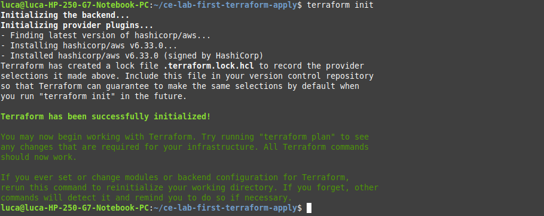
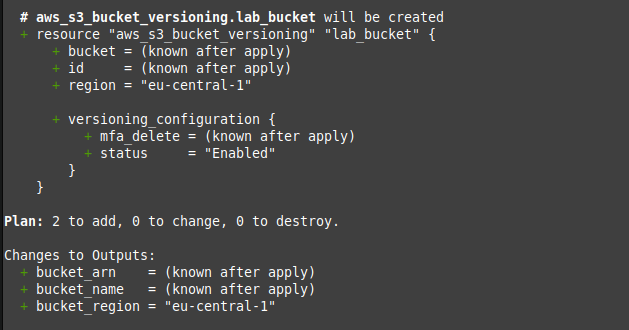
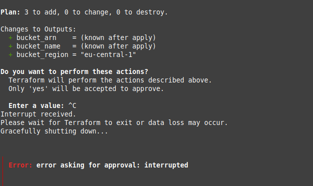
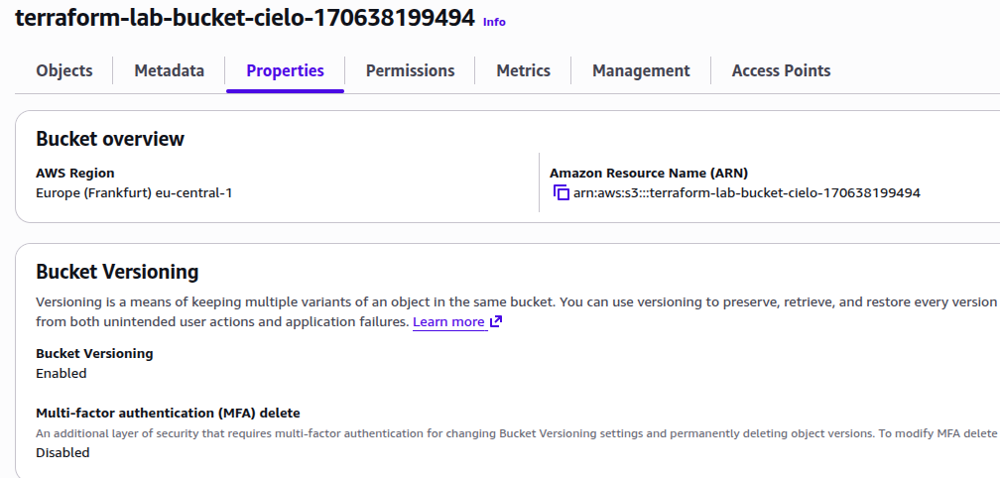
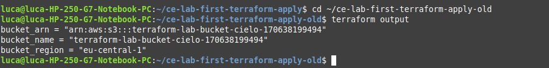
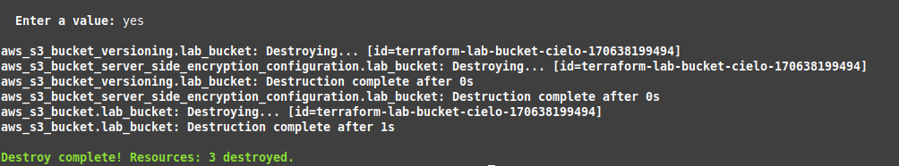

# Lab M4.01 — First Terraform Apply

## Overview

In this lab I created infrastructure in AWS using Terraform for the first time.  
The objective was to understand the Terraform workflow (init → plan → apply → destroy) and how Terraform uses the state file to manage resources.

Region used: eu-central-1  
Bucket created: terraform-lab-bucket-cielo-170638199494  

---

## Lab Objectives Completed

- Set up a Terraform project
- Wrote a basic Terraform configuration
- Executed terraform init, plan, apply and destroy
- Created an AWS S3 bucket using Terraform
- Enabled versioning
- Enabled default server-side encryption (AES256)
- Explored and inspected the Terraform state file
- Destroyed infrastructure safely

---

## Resources Created

- aws_s3_bucket
- aws_s3_bucket_versioning
- aws_s3_bucket_server_side_encryption_configuration

---

## Commands Executed

- terraform init
- terraform validate
- terraform fmt
- terraform plan
- terraform apply
- terraform output
- terraform state list
- terraform state show
- cat terraform.tfstate | jq .
- terraform destroy

---

## Challenges Faced

- Initially configured an invalid AWS region.
- After cloning the repository, Terraform attempted to recreate resources because the state file was not present.
- Learned that the Terraform state file is essential to track existing infrastructure.

---

## Key Learnings

- Terraform depends heavily on the state file.
- Running terraform plan before apply is critical.
- Without the state file, Terraform cannot detect existing resources.
- Infrastructure should be destroyed after testing to avoid unnecessary AWS costs.

---

## Screenshots

### 01 - Terraform Init

### 02 - Terraform Plan

### 03 - Terraform Apply

### 04 - AWS Console Verification

### 05 - Terraform Output

### 06 - Terraform Destroy

